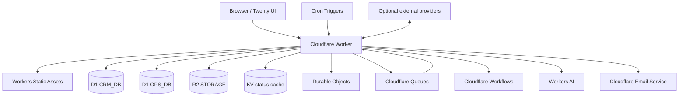

# Twenty CRM — Cloudflare-native edition

[](https://github.com/rikitrader/twenty-cloudflare-native/actions/workflows/supply-chain.yml)
[](LICENSE)
[](https://developers.cloudflare.com/workers/)

A self-contained, Cloudflare-native port of the Twenty CRM experience. It
keeps the upstream Twenty interface and CRM concepts while replacing the
production PostgreSQL, Redis, long-running Node.js server, container, and
persistent-disk requirements with Cloudflare services.

The result is an operationally autonomous Cloudflare application: HTTP,
frontend assets, relational state, files, queues, orchestration, scheduled
work, realtime coordination, AI, email, logs, and recovery controls run on the
Cloudflare platform. Optional Google, Microsoft, SSO, billing, and webhook
integrations remain external by design and are not required for core CRM use.

This is an independent community derivative. It is not an official Twenty or
Cloudflare product and does not imply endorsement by either company.

- Live deployment: <https://crm.mipolitico.com>
- Full implementation status: [`docs/FULL-PARITY-TODO.md`](docs/FULL-PARITY-TODO.md)
- Production evidence: [`docs/PRODUCTION-READINESS-2026-09-17.md`](docs/PRODUCTION-READINESS-2026-09-17.md)
- Self-hosting guide: [`docs/SELF-HOSTING.md`](docs/SELF-HOSTING.md)

## What was built

- The compiled Twenty React interface served through Workers Static Assets.
- A Workers-native REST and GraphQL compatibility layer backed by D1.
- Tenant-scoped workspaces, sessions, API keys, invitations, roles, object
  permissions, field permissions, row predicates, and ownership checks.
- People, companies, opportunities, pipelines, activities, tasks, notes,
  relationships, attachments, custom objects, custom fields, and saved views.
- R2-backed uploads, attachments, large imports, exports, backups, resumable
  transfer state, and authorization checks.
- Queue-backed jobs with idempotency, retries, dead-letter handling, replay,
  durable acceptance, failure visibility, and immutable audit records.
- Workflow-backed imports, exports, and backups.
- Durable Objects for state coordination, schedules, and realtime delivery.
- Signed inbound and outbound webhooks with replay protection and an
  owner/admin delivery ledger.
- Google and Microsoft OAuth authorization-code + PKCE foundations, encrypted
  credentials, serialized refresh, calendar synchronization, and mail-folder
  synchronization.
- Workers AI chat, Cloudflare Email Service, scheduled health/continuity
  collection, structured logs, sampled traces, recovery drills, and release
  gates.
- A read-only PostgreSQL extraction and D1/R2 reconciliation toolkit for
  optional legacy imports. The reference deployment starts natively on D1/R2,
  so PostgreSQL is not a runtime dependency.

## Architecture



| Responsibility | Cloudflare component |
|---|---|
| Frontend, APIs, authentication, webhooks | Workers + Static Assets |
| Authoritative relational CRM and operations state | D1 (`CRM_DB`, `OPS_DB`) |
| Attachments, import/export artifacts, backups | R2 (`STORAGE`) |
| Asynchronous jobs, retries, dead letters | Queues |
| Resumable imports, exports, backups | Workflows |
| Realtime and strongly coordinated state | Durable Objects |
| Disposable status cache | KV |
| Inference and outbound email | Workers AI and Email Service |
| Scheduled reconciliation and evidence | Cron Triggers |

KV is never authoritative for authentication or permissions. Tenant identity
comes from a verified server-side session or API key; a client-provided
workspace ID is insufficient by itself.

## Project status

The implementation is deployed and actively verified, but the repository does
not claim complete upstream Twenty parity or final production readiness. The
readiness endpoint intentionally remains gated until its required observation,
production-browser, WAF, and Logpush evidence exists.

Known product and operational gaps are tracked as checkboxes in
[`docs/FULL-PARITY-TODO.md`](docs/FULL-PARITY-TODO.md). Do not remove or bypass
those gates merely to obtain a green deployment.

## Run locally

Prerequisites:

- Node.js 22 or newer
- npm
- A Cloudflare account for remote bindings and deployment

```bash
git clone https://github.com/rikitrader/twenty-cloudflare-native.git
cd twenty-cloudflare-native
npm ci
npm run patch:twenty
npm run typecheck
npm test
npx wrangler dev
```

The frontend patch step is deterministic and validates the compiled Twenty
module graph after applying compatibility patches.

## Deploy into another Cloudflare account

1. Fork or clone the repository.
2. Copy [`wrangler.example.jsonc`](wrangler.example.jsonc) to your environment
   configuration and replace every value containing `replace`, every all-zero
   identifier, and every `example.com` address.
3. Create separate D1, R2, KV, Queue, Workflow, Durable Object, Access, email,
   and domain resources for your account.
4. Provision secrets with `wrangler secret put`; never commit their values.
5. Apply D1 migrations before deploying code.
6. Run the local verification gates and deploy.

```bash
npx wrangler secret put INTERNAL_SERVICE_TOKEN
npx wrangler secret put WEBHOOK_TOKEN
npx wrangler secret put OUTBOUND_WEBHOOK_SECRET
npx wrangler secret put INTEGRATION_ENCRYPTION_KEY

npx wrangler d1 migrations apply CRM_DB --remote
npx wrangler d1 migrations apply OPS_DB --remote

npm run patch:twenty
npm run typecheck
npm test
npm run db:migrations:check
npm run security:production:check
npx wrangler deploy
```

The complete resource inventory, optional bindings, provider callback URLs,
Access configuration, and fork-safe deployment sequence are documented in
[`docs/SELF-HOSTING.md`](docs/SELF-HOSTING.md).

## Secrets and providers

Core required Worker secrets:

- `INTERNAL_SERVICE_TOKEN`
- `WEBHOOK_TOKEN`
- `OUTBOUND_WEBHOOK_SECRET`
- `INTEGRATION_ENCRYPTION_KEY` — exactly 32 random bytes encoded as documented

Provider integrations can require additional credentials. See
[`docs/PROVIDER-CONFIGURATION.md`](docs/PROVIDER-CONFIGURATION.md). Disabled or
unconfigured providers return explicit errors; they do not return mocked
success.

Never commit `.env`, `.dev.vars`, database exports, customer data,
attachments, private keys, OAuth secrets, or API tokens.

## Verification and operations

```bash
npm test                              # unit and integration tests
npm run typecheck                     # TypeScript verification
npm run db:migrations:check           # migration/schema audit
npm run audit:mutations               # GraphQL classification and durability
npm run test:e2e:ui                   # Playwright journeys
npm run test:a11y                     # accessibility journeys
npm run enterprise:status             # truthful release-gate status
npm run security:production:check     # production configuration assertions
```

Operational documentation:

- [`docs/CLOUDFLARE-NATIVE-DEPLOY.md`](docs/CLOUDFLARE-NATIVE-DEPLOY.md)
- [`docs/runbooks/RECOVERY.md`](docs/runbooks/RECOVERY.md)
- [`docs/runbooks/DLQ-OPERATIONS.md`](docs/runbooks/DLQ-OPERATIONS.md)
- [`docs/runbooks/CLOUDFLARE_RELEASE_CONTROL.md`](docs/runbooks/CLOUDFLARE_RELEASE_CONTROL.md)
- [`docs/runbooks/CLOUDFLARE-EDGE-SECURITY.md`](docs/runbooks/CLOUDFLARE-EDGE-SECURITY.md)
- [`docs/THREAT-MODEL.md`](docs/THREAT-MODEL.md)

## Contributing and security

Contributions are welcome. Read [`CONTRIBUTING.md`](CONTRIBUTING.md) and the
[`CODE_OF_CONDUCT.md`](CODE_OF_CONDUCT.md) before opening a pull request.
Please report vulnerabilities privately according to [`SECURITY.md`](SECURITY.md),
not through public issues.

## License and attribution

This repository is open source and may be used, modified, self-hosted, and
redistributed subject to the applicable licenses. Because it contains and
modifies Twenty source and compiled frontend assets, the upstream AGPLv3 terms,
Twenty Application Exception, package-specific MIT terms, and any files marked
with Twenty's commercial license remain applicable.

See [`LICENSE`](LICENSE) and [`NOTICE.md`](NOTICE.md). Network deployment of a
modified AGPL-covered version can require offering the corresponding source to
its users. Twenty and Cloudflare trademarks are not licensed by this project.
